# 🚀 Coding Interview Solutions
A comprehensive collection of my data structures and algorithms solutions, neatly organized by platform and topic tags!

  

## 📁 LeetCode

### Array
| Problem |
| ------- |
| [0001-two-sum](./LeetCode/Array/0001-two-sum) |
| [0015-3sum](./LeetCode/Array/0015-3sum) |
| [0016-3sum-closest](./LeetCode/Array/0016-3sum-closest) |
| [0026-remove-duplicates-from-sorted-array](./LeetCode/Array/0026-remove-duplicates-from-sorted-array) |
| [0055-jump-game](./LeetCode/Array/0055-jump-game) |
| [0073-set-matrix-zeroes](./LeetCode/Array/0073-set-matrix-zeroes) |
| [0088-merge-sorted-array](./LeetCode/Array/0088-merge-sorted-array) |
| [0121-best-time-to-buy-and-sell-stock](./LeetCode/Array/0121-best-time-to-buy-and-sell-stock) |
| [0167-two-sum-ii-input-array-is-sorted](./LeetCode/Array/0167-two-sum-ii-input-array-is-sorted) |
| [0215-kth-largest-element-in-an-array](./LeetCode/Array/0215-kth-largest-element-in-an-array) |
| [0283-move-zeroes](./LeetCode/Array/0283-move-zeroes) |
| [0322-coin-change](./LeetCode/Array/0322-coin-change) |
| [0455-assign-cookies](./LeetCode/Array/0455-assign-cookies) |
| [0486-predict-the-winner](./LeetCode/Array/0486-predict-the-winner) |
| [0628-maximum-product-of-three-numbers](./LeetCode/Array/0628-maximum-product-of-three-numbers) |
| [0860-lemonade-change](./LeetCode/Array/0860-lemonade-change) |
| [0867-transpose-matrix](./LeetCode/Array/0867-transpose-matrix) |
| [0877-stone-game](./LeetCode/Array/0877-stone-game) |
| [0977-squares-of-a-sorted-array](./LeetCode/Array/0977-squares-of-a-sorted-array) |
| [1288-remove-covered-intervals](./LeetCode/Array/1288-remove-covered-intervals) |
| [1301-number-of-paths-with-max-score](./LeetCode/Array/1301-number-of-paths-with-max-score) |
| [1331-rank-transform-of-an-array](./LeetCode/Array/1331-rank-transform-of-an-array) |
| [1406-stone-game-iii](./LeetCode/Array/1406-stone-game-iii) |
| [1464-maximum-product-of-two-elements-in-an-array](./LeetCode/Array/1464-maximum-product-of-two-elements-in-an-array) |
| [1572-matrix-diagonal-sum](./LeetCode/Array/1572-matrix-diagonal-sum) |
| [1846-maximum-element-after-decreasing-and-rearranging](./LeetCode/Array/1846-maximum-element-after-decreasing-and-rearranging) |
| [1967-number-of-strings-that-appear-as-substrings-in-word](./LeetCode/Array/1967-number-of-strings-that-appear-as-substrings-in-word) |
| [1979-find-greatest-common-divisor-of-array](./LeetCode/Array/1979-find-greatest-common-divisor-of-array) |
| [2812-find-the-safest-path-in-a-grid](./LeetCode/Array/2812-find-the-safest-path-in-a-grid) |
| [3020-find-the-maximum-number-of-elements-in-subset](./LeetCode/Array/3020-find-the-maximum-number-of-elements-in-subset) |
| [3286-find-a-safe-walk-through-a-grid](./LeetCode/Array/3286-find-a-safe-walk-through-a-grid) |
| [3312-sorted-gcd-pair-queries](./LeetCode/Array/3312-sorted-gcd-pair-queries) |
| [3336-find-the-number-of-subsequences-with-equal-gcd](./LeetCode/Array/3336-find-the-number-of-subsequences-with-equal-gcd) |
| [3457-eat-pizzas](./LeetCode/Array/3457-eat-pizzas) |
| [3514-number-of-unique-xor-triplets-ii](./LeetCode/Array/3514-number-of-unique-xor-triplets-ii) |
| [3534-path-existence-queries-in-a-graph-ii](./LeetCode/Array/3534-path-existence-queries-in-a-graph-ii) |
| [3620-network-recovery-pathways](./LeetCode/Array/3620-network-recovery-pathways) |
| [3731-find-missing-elements](./LeetCode/Array/3731-find-missing-elements) |
| [3737-count-subarrays-with-majority-element-i](./LeetCode/Array/3737-count-subarrays-with-majority-element-i) |
| [3739-count-subarrays-with-majority-element-ii](./LeetCode/Array/3739-count-subarrays-with-majority-element-ii) |
| [3842-toggle-light-bulbs](./LeetCode/Array/3842-toggle-light-bulbs) |
| [3867-sum-of-gcd-of-formed-pairs](./LeetCode/Array/3867-sum-of-gcd-of-formed-pairs) |
| [3898-find-the-degree-of-each-vertex](./LeetCode/Array/3898-find-the-degree-of-each-vertex) |

### Database
| Problem |
| ------- |
| [0197-rising-temperature](./LeetCode/Database/0197-rising-temperature) |
| [0584-find-customer-referee](./LeetCode/Database/0584-find-customer-referee) |
| [0595-big-countries](./LeetCode/Database/0595-big-countries) |
| [0626-exchange-seats](./LeetCode/Database/0626-exchange-seats) |
| [1068-product-sales-analysis-i](./LeetCode/Database/1068-product-sales-analysis-i) |
| [1148-article-views-i](./LeetCode/Database/1148-article-views-i) |
| [1204-last-person-to-fit-in-the-bus](./LeetCode/Database/1204-last-person-to-fit-in-the-bus) |
| [1378-replace-employee-id-with-the-unique-identifier](./LeetCode/Database/1378-replace-employee-id-with-the-unique-identifier) |
| [1581-customer-who-visited-but-did-not-make-any-transactions](./LeetCode/Database/1581-customer-who-visited-but-did-not-make-any-transactions) |
| [1683-invalid-tweets](./LeetCode/Database/1683-invalid-tweets) |
| [1757-recyclable-and-low-fat-products](./LeetCode/Database/1757-recyclable-and-low-fat-products) |

### Depth First Search
| Problem |
| ------- |
| [2492-minimum-score-of-a-path-between-two-cities](./LeetCode/Depth-First-Search/2492-minimum-score-of-a-path-between-two-cities) |
| [2685-count-the-number-of-complete-components](./LeetCode/Depth-First-Search/2685-count-the-number-of-complete-components) |

### Dynamic Programming
| Problem |
| ------- |
| [3699-number-of-zigzag-arrays-i](./LeetCode/Dynamic-Programming/3699-number-of-zigzag-arrays-i) |

### Hash Table
| Problem |
| ------- |
| [0142-linked-list-cycle-ii](./LeetCode/Hash-Table/0142-linked-list-cycle-ii) |
| [0242-valid-anagram](./LeetCode/Hash-Table/0242-valid-anagram) |
| [1189-maximum-number-of-balloons](./LeetCode/Hash-Table/1189-maximum-number-of-balloons) |
| [1358-number-of-substrings-containing-all-three-characters](./LeetCode/Hash-Table/1358-number-of-substrings-containing-all-three-characters) |
| [3016-minimum-number-of-pushes-to-type-word-ii](./LeetCode/Hash-Table/3016-minimum-number-of-pushes-to-type-word-ii) |

### Linked List
| Problem |
| ------- |
| [0002-add-two-numbers](./LeetCode/Linked-List/0002-add-two-numbers) |
| [0876-middle-of-the-linked-list](./LeetCode/Linked-List/0876-middle-of-the-linked-list) |

### Math
| Problem |
| ------- |
| [0070-climbing-stairs](./LeetCode/Math/0070-climbing-stairs) |
| [0292-nim-game](./LeetCode/Math/0292-nim-game) |
| [0326-power-of-three](./LeetCode/Math/0326-power-of-three) |
| [0509-fibonacci-number](./LeetCode/Math/0509-fibonacci-number) |
| [3014-minimum-number-of-pushes-to-type-word-i](./LeetCode/Math/3014-minimum-number-of-pushes-to-type-word-i) |
| [3348-smallest-divisible-digit-product-ii](./LeetCode/Math/3348-smallest-divisible-digit-product-ii) |
| [3536-maximum-product-of-two-digits](./LeetCode/Math/3536-maximum-product-of-two-digits) |
| [3658-gcd-of-odd-and-even-sums](./LeetCode/Math/3658-gcd-of-odd-and-even-sums) |
| [3700-number-of-zigzag-arrays-ii](./LeetCode/Math/3700-number-of-zigzag-arrays-ii) |
| [3754-concatenate-non-zero-digits-and-multiply-by-sum-i](./LeetCode/Math/3754-concatenate-non-zero-digits-and-multiply-by-sum-i) |
| [3783-mirror-distance-of-an-integer](./LeetCode/Math/3783-mirror-distance-of-an-integer) |

### Stack
| Problem |
| ------- |
| [0094-binary-tree-inorder-traversal](./LeetCode/Stack/0094-binary-tree-inorder-traversal) |
| [0145-binary-tree-postorder-traversal](./LeetCode/Stack/0145-binary-tree-postorder-traversal) |

### String
| Problem |
| ------- |
| [0008-string-to-integer-atoi](./LeetCode/String/0008-string-to-integer-atoi) |
| [3517-smallest-palindromic-rearrangement-i](./LeetCode/String/3517-smallest-palindromic-rearrangement-i) |

### Tree
| Problem |
| ------- |
| [0100-same-tree](./LeetCode/Tree/0100-same-tree) |
| [0101-symmetric-tree](./LeetCode/Tree/0101-symmetric-tree) |
| [0104-maximum-depth-of-binary-tree](./LeetCode/Tree/0104-maximum-depth-of-binary-tree) |

### Two Pointers
| Problem |
| ------- |
| [0125-valid-palindrome](./LeetCode/Two-Pointers/0125-valid-palindrome) |
| [3302-find-the-lexicographically-smallest-valid-sequence](./LeetCode/Two-Pointers/3302-find-the-lexicographically-smallest-valid-sequence) |

### Unknown
| Problem |
| ------- |
| [1291-sequential-digits](./LeetCode/Unknown/1291-sequential-digits) |

## 📁 GeeksForGeeks

| Problem |
| ------- |
| [Activity Selection - GFG](./GeeksForGeeks/Activity%20Selection%20-%20GFG) |
| [Meeting Rooms - GFG](./GeeksForGeeks/Meeting%20Rooms%20-%20GFG) |
| [Shortest Job first - GFG](./GeeksForGeeks/Shortest%20Job%20first%20-%20GFG) |

